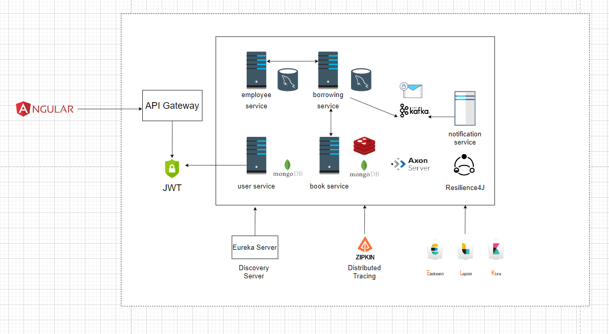
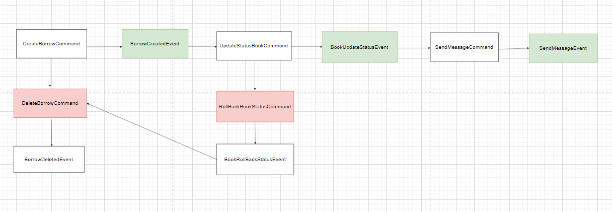
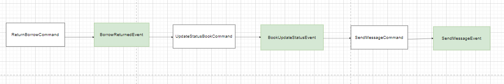

# MicroLib-Java-Angular
* This app is a fullstack web app for mamaging borrowing/returning books in the Library system. 
* The frontend is built with Angular and NgRx for global-state management. 
* Besides, backend is a microservices-based application, following Event-Driven Architecture using Spring framework.

Terms: 
* Angular, NgRx, Spring boot, Spring cloud, Spring security, Eureka server, API gateway, distributed tracing with Zipkin, Resilience4J.
* Axon server, Apache Kafka
* MySQL, MongoDB
---
## Architecture Diagram:

---
## Saga LifeCycle of Borrowing Book:

---
## Saga LifeCycle of Returning Book:

